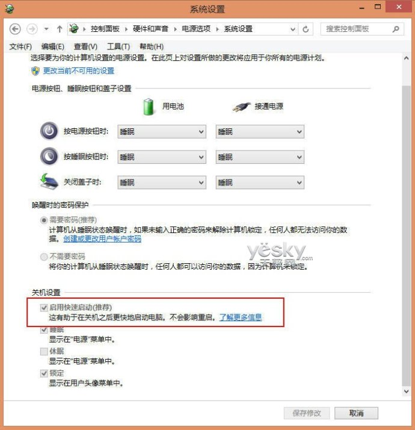

# 常见问题

## 快捷键


## 避免 sudo 输入密码

-   运行：

    `sudo visudo`
    
-   在尾部增加：

    ```
    # 属于 mwn 组的用户运行 sudo 不需要密码
    %mwn ALL=(ALL:ALL) NOPASSWD: ALL
    ```

## 进程和端口

-   查特定程序的进程号

    `pgrep redis`

    `ps -e | grep redis`

-   根据端口号查进程

    `netstat -lnp  | grep 6379`

    `$ lsof -Pnl +M -i4 | grep 20880`

    [详细资料](http://www.linuxidc.com/Linux/2012-09/69684.htm)

## 让命令运行在后台

-   方法一

    `nohub <cmd> &`

-   方法二

    将一个或多个命名包含在“()”中就能让这些命令在子 shell 中运行中

    当我们将"&"也放入“()”内之后，我们就会发现所提交的作业并不在作业列表中，无法通过jobs来查看

    `(ping www.ibm.com &)`

## 卸载不常用的软件

-   删除libreoffice

    `sudo apt-get remove libreoffice-common`

-   删除Amazon的链接

    `sudo apt-get remove unity-webapps-common`

-   删掉基本不用的自带软件

    ```
    sudo apt-get remove thunderbird totem rhythmbox empathy brasero simple-scan gnome-mahjongg aisleriot gnome-mines cheese transmission-common gnome-orca webbrowser-app gnome-sudoku landscape-client-ui-install onboard deja-dup
    ```

## vi 编辑器上下左右键变成ABCD

-   解决办法

    可以在终端中输入如下命令：
    
    ```
    export TERM=linux
    ```

## 配置apt-get 源

-   编辑：

    `vi /etc/apt/sources.list`
    
-   增加国内源：

    ```
    # 搜狐源：
    deb http://mirrors.sohu.com/ubuntu/ precise-updates main restricted
    deb-src http://mirrors.sohu.com/ubuntu/ precise-updates main restricted
    deb http://mirrors.sohu.com/ubuntu/ precise universe
    deb-src http://mirrors.sohu.com/ubuntu/ precise universe
    deb http://mirrors.sohu.com/ubuntu/ precise-updates universe
    deb-src http://mirrors.sohu.com/ubuntu/ precise-updates universe
    deb http://mirrors.sohu.com/ubuntu/ precise multiverse
    deb-src http://mirrors.sohu.com/ubuntu/ precise multiverse
    deb http://mirrors.sohu.com/ubuntu/ precise-updates multiverse
    deb-src http://mirrors.sohu.com/ubuntu/ precise-updates multiverse
    deb http://mirrors.sohu.com/ubuntu/ precise-backports main restricted universe multiverse
    deb-src http://mirrors.sohu.com/ubuntu/ precise-backports main restricted universe multiverse

    # 网易源：
    deb http://mirrors.163.com/ubuntu/ precise-updates main restricted
    deb-src http://mirrors.163.com/ubuntu/ precise-updates main restricted
    deb http://mirrors.163.com/ubuntu/ precise universe
    deb-src http://mirrors.163.com/ubuntu/ precise universe
    deb http://mirrors.163.com/ubuntu/ precise-updates universe
    deb-src http://mirrors.163.com/ubuntu/ precise-updates universe
    deb http://mirrors.163.com/ubuntu/ precise multiverse
    deb-src http://mirrors.163.com/ubuntu/ precise multiverse
    deb http://mirrors.163.com/ubuntu/ precise-updates multiverse
    deb-src http://mirrors.163.com/ubuntu/ precise-updates multiverse
    deb http://mirrors.163.com/ubuntu/ precise-backports main restricted universe multiverse
    deb-src http://mirrors.163.com/ubuntu/ precise-backports main restricted universe multiverse
    ```

## 不能识别移动硬盘

-   安装：

    `sudo apt-get install cifs-utils`

## 双显卡设备出现未知显示器

-   详细：

    <http://www.kaijia.me/2014/04/ubuntu-14-04-unknown-display-in-dual-graphics-solved/>

-   原因：

    官方对这个错误的解释是双显卡驱动的情况下（比如Kaijia的笔记本是就是集显和N卡热切换）Ubuntu会同时读出两个显示器，显示的效果即为一个内置显示器和一个未知显示器。

-   解决：

    `sudo apt-get install bumblebee-nvidia`

## 双显示器扩展方式外接显示器分辨率低

-   详细：
   
    <http://www.linuxidc.com/Linux/2010-09/28586.htm>

-   `cvt 1440 900`

    结果如下

    ```
    # 1440x900 59.89 Hz (CVT 1.30MA) hsync: 55.93 kHz; pclk: 106.50 MHz
    Modeline "1440x900_60.00"  106.50  1440 1528 1672 1904  900 903 909 934 -hsync +vsync
    ```

    Modeline后面的值在下边要用。然后执行

-   `xrandr`

    得到显示器名称，我的为 VGA1，笔记本为LVDS1，大家以此类推，不一定都一样

-   `sudo xrandr --newmode "1440x900_60.00" 106.50 1440 1528 1672 1904 900 903 909 934 -hsync +vsync`

    参数就是cvt结果中Modeline后面的那一堆，根据自己的参数调整。

-   `xrandr`

    就可以看到新加的那个设置了。

-   `sudo xrandr --addmode VGA1 "1440x900_60.00"`
    添加新的mode

-   添加启动脚本：

    编辑 `/etc/rc.local`

    ```
    xrandr --newmode "1440x900_60.00"  106.50  1440 1528 1672 1904  900 903 909 934 -hsync +vsync
    xrandr --addmode VGA1 "1440x900_60.00"
    xrandr --output LVDS1 --mode 1366x768
    xrandr --output VGA1 --mode 1440x900_60.00
    xrandr --output VGA1 --right-of LVDS1
    ```

## 禁用错误提示.

-   查看错误提示文件

    `$ ls /var/crash/`

-   禁用错误提示“System Program problem detected”

    编辑apport文件 `/etc/default/apport`

    找到 enabled=1 这一行，并改变到0(zero)

    ```
    # set this to 0 to disable apport, or to 1 to enable it
    # you can temporarily override this with
    # sudo service apport start force_start=1
    enabled=0
    ```

    保存，退出。停止apport服务：

    `$ sudo stop apport`

## 解决解压 zip 文件中文乱码问题

-   通过 unzip 命令解压，指定字符集

    `unzip -O CP936 xxx.zip`  (用GBK, GB18030也可以)

    unzip 的 manual 中并无这个选项的说明, unzip --help对这个参数有一行简单的说明。

-   写入环境变量

    `alias unzip="unzip -O CP936"`

## win7/8 + Ubuntu 双系统直接进入 Ubuntu

-   执行以下命令，然后重启

    `$ sudo update-grub`

## win7/8 + Ubuntu 双系统不能挂载 ntfs 磁盘


-   原理

    Win8默认开启了快速启动功能，即“混合启动”。简单说，“混合启动”的原理是关机的时候只关闭用户会话，
    让系统内核会话转入休眠状态，从而有效提高Win8系统的启动速度。这也是win8关闭和启动都很快，重启
    很慢的原因。而这种休眠状态下的磁盘Ubuntu认为处于一种不安全的状态，所以拒绝挂载。因此我们可以
    选择先进入Win8系统，然后重启，并进入Ubuntu的系统，即可以自动挂载。
    
    当然，每次选择进入WIn8再重启的方式肯定让人无法接受，那么可以选择关闭Win8的快速启动功能，就
    可以彻底解决这个问题。
    
-   方法

    进入控制面板，依次打开“控制面板—系统和安全—电源选项—选择电源按钮的功能”。如下图设置：

    

    首先点击上部分的“更改当前不可用的设置”，然后去掉“启用快速启动（推荐）”前面的勾即可。这个时候
    再选择win8关机后，就是完全关机了。

    注意：即使去掉了快速启动，如果Win8非正常关机，也可能会引起上面的挂载磁盘失败的问题，这时候可以
    选择正常启动Win8，然后再关机即可。

    参考资料： <http://blog.sina.com.cn/s/blog_5c9a54e30101v3zo.html>

-   另外一种方法：

    1、打开终端：如果没有安装ntfs-3g就要安装：sudo apt-get install ntfs-3g

    2、修复挂载错误的相应的分区，例如提示中的/dev/sda8，输入： `sudo ntfsfix /dev/sda8`

    参考资料： <http://ask.csdn.net/questions/188940>

## win7/8 + Ubuntu 双系统 win 耳机没声音

-   解决方法

    在 windows 系统中点击休眠，再重新唤醒就可以了

    最简单的合上笔记本盖子再重新打开。。。

## 黑苹果安装卡在 PCI configuration begin 

-   解决方法

    如果是华硕电脑，重启进入 bios，将 Legacy USB Support 选项设置为 disabled

## 黑苹果安装卡在 hfs： mounted xxx

-   问题描述

    黑苹果安装卡在 hfs： mounted xxx Install on device disk0s6

-   解决方法

    重新启动时加上 -x 选项

# 开发工具

## oh-my-zsh
-   官网

    <https://github.com/robbyrussell/oh-my-zsh>

-   学习 

    <http://zhuanlan.zhihu.com/mactalk/19556676>

-   安装

    安装zsh: 

    `sudo apt-get install zsh`

    安装oh-my-zs：
    
    方式一： curl

    `sh -c "$(curl -fsSL https://raw.github.com/robbyrussell/oh-my-zsh/master/tools/install.sh)"`

    方式二： wget

    `sh -c "$(wget https://raw.github.com/robbyrussell/oh-my-zsh/master/tools/install.sh -O -)"`

    设置为默认shell: (重启后生效)

    `chsh -s /bin/zsh`

-   配置
    
    设置个人常用命令别名(配置: ~/.zshrc)

    ```
    alias c="clear"
    alias s="subl"
    
    alias gs="git status"
    alias gb="git branch"
    alias gc="git checkout"
    
    alias sc="subl ~/.zshrc"
    alias scs="source ~/.zshrc"
    ```

    使配置生效: 

    `source ~/.zshrc`

## autojump

-   官网： <https://github.com/wting/autojump>

-   安装: 

    `sudo apt-get install autojump`

-   配置: ~/.zshrc  

    `plugins=(git autojump)`

-   使配置生效:

    `source ~/.zshrc`

## git

-   安装

    `sudo apt-get install git`

## node

-   安装

    `wget -qO- https://raw.githubusercontent.com/creationix/nvm/v0.27.0/install.sh | bash`

    `nvm install 0.10.38`

    `nvm use 0.10.38`

    `npm install -g npm@2.9.0`

-   全局安装常用模块

    `npm install -g http-server`

    `npm install -g mongo-express`

## mongodb

-   安装

    `sudo apt-get install mongodb`

## vi 

-   编辑模式

    移动光标

    ```
    h            j            k            l
    左           下           上           右

    最上行:                    H
    中间行:                    M
    最下行:                    L

    本行开头:                  0    
    本行的第一个非空字符：       ^
    本行末尾:                  $

    到一个字的开头:             b
    到一个字的末尾:             e
    ```

    替换和删除

    ```
    替换字符                    r_
    删除字符                    x
    删除行：                    dd
    
    删除字：

    光标位置   两字之间的空格：          在一个字的首字符：  不在一个字的首字符：
    dw         删除空格                 删除当前字         删除当前字符，直到下一个字的首字母
    db          删除前一个字, 不删除空格   删除前一个字       删除前一个字符，直到空格
    ```

    粘贴和复制

    ```
    剪切行：                   dd
    复制行：                   yy
    粘贴到光标前面：            P
    粘贴到光标后面：            p
    ```

    搜索字符串

    ```
    正向搜索：                  /string
    反向搜索：                  ?string
    搜索下一个：                n
    ```

    撤销和重复

    ```
    撤销：                      u
    重复：                      .
    ```

    其他命令

    ```
    查找光标所在单词的手册：      K
    保存退出vi：                ZZ
    ```

    进入插入模式

    ```
    光标左侧：                  i
    光标右侧：                  a

    光标所在行开头:              I
    光标所在行结尾:              A

    光标上一行:                 O
    光标下一行:                 o
    ```

-   插入模式
    
    退出插入模式：              ESC


-   命令模式

    行号

    ```
    移动到第n行                 :n    .(光标所在行)    $(末尾行)
    ```

    保存和文件

    ```
    :w                    保存        
    :wq                   保存退出
    :q!                   不保存退出
    :w [file]             另存为
    :a,bw [file]          将第a行至第b行写入file文件
    :r [file]             读取fle文件的内容，插入当前光标所在行的后面
    :e [file]             编辑新文件
    :f [file]             重命名文件
    :f                    输出当前文件名称和状态
    ```

    搜索和替换

    ```
    :/str/                 正向搜索
    :?str?                 反向搜索
    :1,$ s/str1/str2/      用str2替换正文中首次出现的str1
    :1,$ s/str1/str2/g     用str2替换正文中每次出现的str1
    ```

    删除正文

    ```
    :d                     删除光标所在行
    :d .,$d                删除当前行至正文末尾
    ```

    恢复文件

    ```
    :recover               上次编辑意外退出，从临时文件恢复文件内容(该文件以.开头，并以.swp 结尾)
    ```

    选项设置

    ```
    :set [option]
       autoindent        设置该选项，则正文自动缩进；
       ignorecase        设置该选项，则忽略规则表达式中大小写字母的区别；
       number            设置该选项，则显示正文行号；
       ruler             设置该选项，则在屏幕底部显示光标所在行、列的位置；
       tabstop           设置按 Tab 键跳过的空格数。例如 :set tabstop=n，n 默认值为 8；
       mk                将选项保存在当前目录的 .exrc 文件中；
    ```

    执行shell命令

    ```
    :![command]            无需退出vi即可执行linux命令
    ```

## upstart

-   官网

    <http://upstart.ubuntu.com>

-   简介

    Upstart 可以优雅地管理所有Linux程序的启动和停止,包括Node程序。

    Upstart支持现代版的Ubuntu和 CentOS。

-   安装

    Ubuntu: `sudo apt-get install upstart`

    CentOS: `sudo yum install upstart`

-   配置文件

    `sudo touch /etc/init/hellonode.conf`

-   配置选项

    把下面代码清单中的内容添加到你的配置文件中。这个设置会在你的服务器启动时运行你的
    程序,并在服务器关闭前停止它。其中的 exec 部分由 Upstart执行。

    ```
    #!upstart

    author "mcantelon"
    description "hellonode"
    setuid "nonrootuser"

    start on (local-filesystems and net-device-up IFACE=eth0)
    stop on shutdown
    respawn

    console log

    env NODE_ENV=production

    exec /usr/bin/node /path/to/server.js
    ```

    1.指定程序的作者

    2.设定程序的名称或描述

    3.用 nonrootuser 用户运行程序

    4.系统启动时,在文件系统和网络可用之后启动程序

    5.关闭时停止程序

    6.在程序崩溃时重启程序

    7.将 stdin 和 stderr 输出到 /var/log/upstart/yourapp.log

    8.为程序设定必要的环境变量

    9.指定执行程序的命令

## redis

-   安装

    `sudo apt-get install redis-server`

## nginx

-   简介

    尽管Node在提供动态内容服务时很高效,但在提供图片、 CSS样式表或客户端JavaScript等静
    态文件服务时并不是最有效的办法。

    通过HTTP提供静态文件的服务应该交给专门针对这个特定任务优化过的特定软件项目,
    因为它们多年以来主要专注于这项任务。

    Nginx (http://nginx.org/en/) 是一个专门针对静态文件服务做过优化的开源Web服务器,很容
    易设置成跟Node一起提供那些文件服务。在典型的Nginx/Node配置中,一般由Nginx先处理所有
    Web请求,再将非静态文件的请求转给Node。

-   安装

    `sudo apt-get install nginx`

-   配置文件

    `/etc/nginx/nginx.conf`

-   配置选项

    ```
    http {
      upstream my_node_app {
        server 127.0.0.1:8000;
      }
      server {
        listen 80;
        server_name localhost domain.com;
        access_log /var/log/nginx/my_node_app.log;
        location ~ /static/ {
          root /home/node/my_node_app;
          if (!-f $request_filename) {
            return 404;
          }
        }
        location / {
          proxy_pass http://my_node_app;
          proxy_redirect off;
          proxy_set_header X-Real-IP $remote_addr;
          proxy_set_header X-Forwarded-For $proxy_add_x_forwarded_for;
          proxy_set_header Host $http_host;
          proxy_set_header X-NginX-Proxy true;
        }
      }
    }
    ```
## rar

-   安装

    `sudo apt-get install rar`

    `sudo apt-get install unrar`

## curl

-   安装

    `$ sudo apt-get install curl`

-   下载

    http:

    `curl -C -O http://cgi2.tky.3wb.ne.jp/~zzh/screen1.JPG`

    ftp:

    `curl -u name:passwd ftp://ip:port/path/file`

    `curl ftp://name:passwd@ip:port/path/file` 

-   上传

    http:

    `curl -T localfile http://cgi2.tky.3web.ne.jp/~zzh/abc.cgi`

    这时候，使用的协议是HTTP的PUT method 

    ftp:

    `curl -T localfile -u name:passwd ftp://upload_site:port/path/`

-   表单提交

    GET:

    `curl http://www.yahoo.com/login.cgi?user=nickwolfe&password=12345`

    GET模式什么option都不用，只需要把变量写在url里面就可以了 

    POST:

    `curl -d "user=nickwolfe&password=12345" http://www.yahoo.com/login.cgi`

    POST模式下的文件上的文件上传：

    ``` HTML
    <form method="POST" enctype="multipar/form-data" action="http://cgi2.tky.3web.ne.jp/~zzh/up_file.cgi"> 
      <input type=file name=upload> 
      <input type=submit name=nick value="go"> 
    </form> 
    ```

    这样一个HTTP表单，我们要用curl进行模拟，就该是这样的语法： 

    ```
    curl -F upload=@localfile -F nick=go http://cgi2.tky.3web.ne.jp/~zzh/up_file.cgi
    ```

-   其它参数

    ```
    -i --include 把响应头输出出来
    ```

## java

-   使用 APT 安装 jdk

    `sudo apt-get install openjdk-7-jdk`

-   环境变量

    ```
    export JAVA_HOME=/usr/lib/jvm/java-7-openjdk-amd64
    export JRE_HOME=/usr/lib/jvm/java-7-openjdk-am64/jre
    export CLASSPATH=.:JAVAHOME/lib:JRE_HOME/lib:$CLASSPATH
    export PATH=JAVAHOME/bin:JRE_HOME/bin:$PATH
    ```

## android

-   下载 android-studio

    android-studio-ide-135.1629389-linux.zip

-   解压运行 

    `bin/studio.sh`

-   配置环境变量：

    ```
    export ANDROID_HOME=/home/mwn/Android/Sdk
    PATH=$PATH:/home/mwn/Android/Sdk/tools
    PATH=$PATH:/home/mwn/Android/Sdk/platform-tools
    ```

-   编译报错问题:
    
    1.  `Cannot run   program "xxx/build-tools/21.1.0/aapt"`
        
        解决方案：

        ```
        sudo apt-get install lib32z1
        sudo apt-get install lib32stdc++6
        ```

        详细： <http://jingyan.baidu.com/article/e73e26c0dab30224adb6a782.html>

    2.  `/com.android.support/appcompat-v7/23.0.0/res/values-v23/values-v23.xml`

        解决方案：

        ```
        进入 Android/sdk/extras/android/m2repository/com/android/support/appcompat-v7
        删除23.0.0文件夹，删除maven-metadata.xml中的<version>23.0.0</version>`
        ```

        详细： <http://www.68idc.cn/help/buildlang/ask/20150901530664.html>

## ack-grep

-   安装

    `sudo apt-get install ack-grep`

## lsof

# 辅助工具

## Sublime Text 3

-   安装

    `sudo add-apt-repository ppa:webupd8team/sublime-text-3`

    `sudo apt-get update`

    `sudo apt-get install sublime-text`

## zeal

-   安装

    `$ sudo add-apt-repository ppa:zeal-developers/ppa`
    
    `$ sudo apt-get update`

    `$ sudo apt-get install zeal`

## vsc

-   官网下载 deb 包

    <https://code.visualstudio.com/>

## robomongo

-   官网下载 deb 包

    `wget http://app.robomongo.org/files/linux/robomongo-0.8.5-x86_64.deb`

-   其它版本

    <http://app.robomongo.org/download.html>

## xmind

-   官网下载 deb 包

    `wget http://xiazai.xmindchina.cn/trail/xmind-7-linux-amd64.deb`

## Chrome

-   官网下载 deb 包

    `wget https://dl.google.com/linux/direct/google-chrome-stable_current_amd64.deb`

-   安装常用插件

    Postman, JSONView

# 应用程序

## sogoupinyin

-   官网下载 deb 包

    <http://pinyin.sogou.com/linux/>

-   配置

    打开 Fcitx configuration ， 选择 '+' ，把 Only show current language 取消勾选，搜索 pinyin 添加进来

## WPS Office

-   安装

    `sudo apt-get install wps-office`

## smplayer

-   安装

    `sudo apt-get install smplayer`

## amule

-   简介

    下载工具

-   安装

    `sudo apt-get install amule amule-utils`

-   配置与chrome关联

    `sudo gedit /usr/bin/xdg-open`

    将其中open-gnome处改为

    ``` 
    open_gnome()
    {
        if echo "$1" | grep -q '^ed2k://'; then
        ed2k "$1"

        elif gvfs-open --help 2>/dev/null 1>&2; then
            gvfs-open "$1"
        else
            gnome-open "$1"
        fi

        if [ $? -eq 0 ]; then
            exit_success
        else
            exit_failure_operation_failed
        fi
    }
    ```

## virtualbox

-   安装

    下载地址： <http://download.virtualbox.org/virtualbox/5.0.10/virtualbox-5.0_5.0.10-104061~Ubuntu~trusty_amd64.deb>

-   使用 Virtualbox 安装 Windows

    <http://www.linuxidc.com/Linux/2012-11/74195p3.htm>

